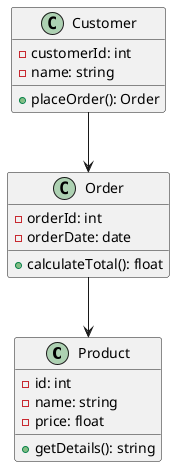
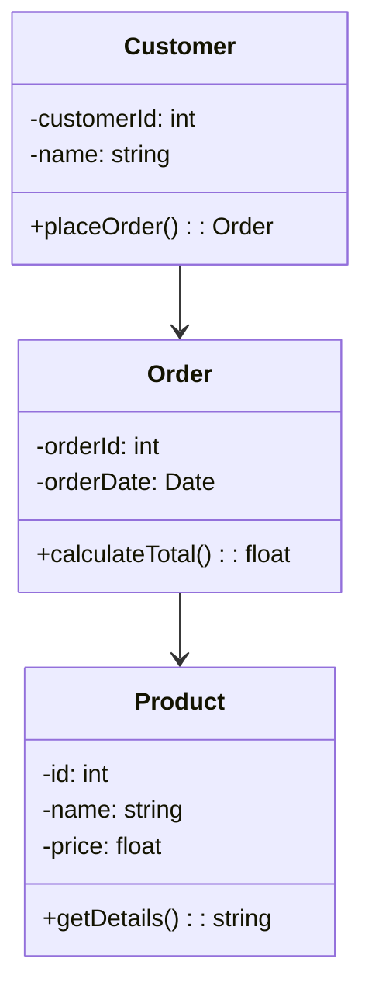

Here's a sample blog post tailored to **creating UML diagrams using GitHub Copilot**. This blog is ideal for developers or technical writers who want to leverage AI tools to accelerate UML documentation.

---

## 🚀 How to Create UML Diagrams Using GitHub Copilot

UML (Unified Modeling Language) diagrams are essential tools in software design, helping teams visualize system architecture, object relationships, and workflows. If you're using GitHub Copilot, you can supercharge your UML creation process with AI assistance — especially in writing code for diagramming tools like **PlantUML** or **Mermaid**.

In this blog, we’ll walk through how to use GitHub Copilot to create UML diagrams quickly, effectively, and directly from your code editor.

---

### 📦 Prerequisites

* GitHub Copilot (enabled on your GitHub account)
* A code editor like **Visual Studio Code**
* Extensions:

  * **PlantUML** or **Markdown Preview Mermaid Support**
  * **Live Preview** or similar for real-time diagram rendering

---

### ✏️ Step 1: Start with a UML Comment Block

Let GitHub Copilot know you're about to write a UML diagram. For example, type a comment like this in a `.puml` or `.md` file:

```
// Create a class diagram for an e-commerce application
```

Copilot will automatically suggest a block of UML code. Accept or edit it as needed.

---

### 🧠 Step 2: Let Copilot Generate the Diagram Code

Once you give context, Copilot will suggest something like this (for PlantUML):



Or if you're using Mermaid inside Markdown:





Just typing `// create a sequence diagram` can also prompt Copilot to generate a complete interaction flow.

---

### 🛠️ Step 3: Preview Your Diagram

* For **PlantUML**, use the “PlantUML Preview” extension in VS Code.
* For **Mermaid**, preview it directly in Markdown or through live renderers like [StackEdit](https://stackedit.io/) or the Markdown Preview Mermaid extension.

---

### 🎯 Tips for Better Copilot Results

* Use clear, descriptive comments.
* Break your code into logical parts — Copilot works best when context is tight.
* Use domain-specific language (e.g., `// Create a login sequence diagram for authentication flow`).
* Don't hesitate to regenerate suggestions if the first one isn’t accurate.

---

### ✅ Why Use Copilot for UML?

* **Speed**: Skip manual syntax writing.
* **Clarity**: Better diagram templates from minimal effort.
* **Consistency**: Generates diagram code based on typical patterns and best practices.

---

### 🧩 Bonus: Generate UML from Code

If you're using languages like Java or Python, Copilot can even help generate UML code from your class structures when you add comments like:

```python
# Create a UML class diagram for the following class:
class User:
    def __init__(self, id, name):
        self.id = id
        self.name = name
```

You’ll often get a matching `@startuml` block as a suggestion!

---

### 💬 Conclusion

GitHub Copilot isn't just for writing code — it's a smart companion for software design too. With just a few prompts, you can generate UML diagrams that help document and communicate your system’s architecture clearly and effectively.

Start using Copilot today to accelerate your design documentation process!

---
